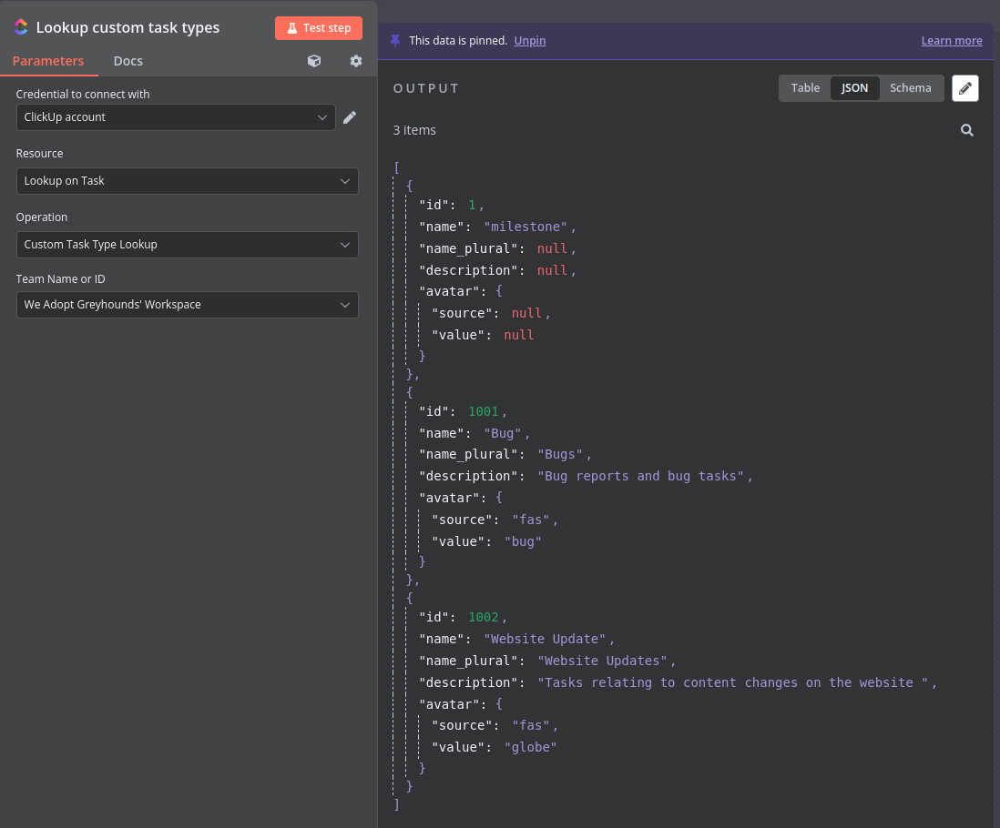
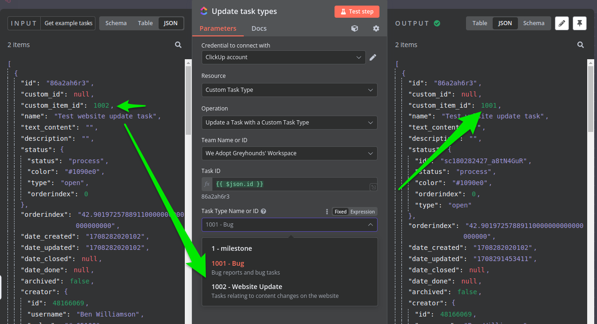
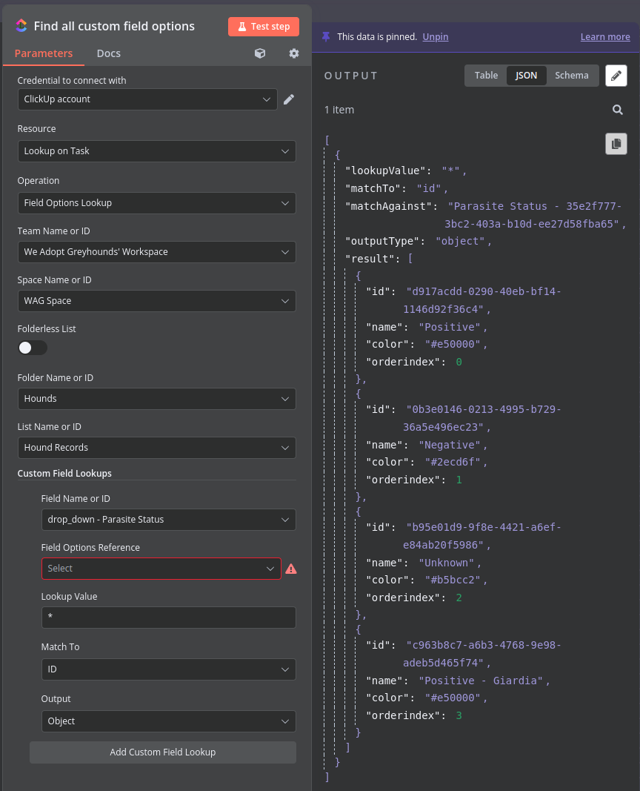
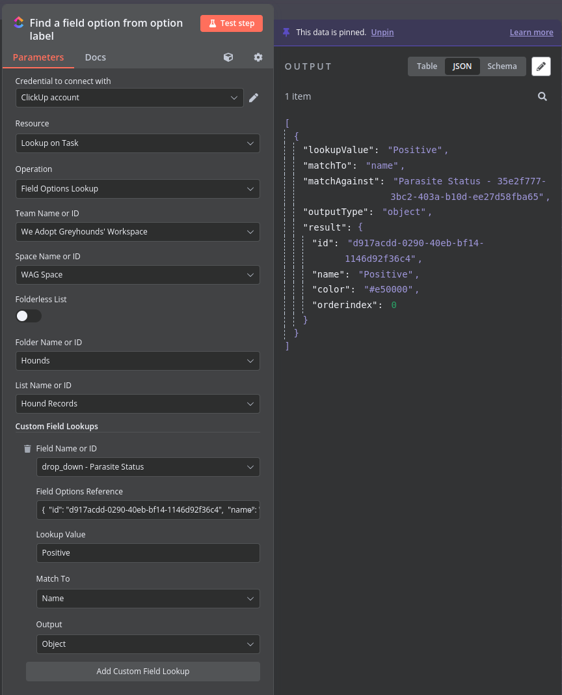

# n8n-nodes-clickuplookup

This is an n8n community node. It lets you easily compare values to drop-down fields and their options in ClickUp, in your n8n workflows.

[ClickUp](https://clickup.com) is a highly versatile and powerful project management tool that can be used by both teams and individuals. It combines important business application features and consolidates company project data into a single online solution.

There is already a [core ClickUp node in n8n](https://n8n.io/integrations/clickup/) - but it does standard actions like getting and setting tasks, fields, settings, etc. ClickUp fields can be complex and dynamic - often you do not know the ID of the field you want to work with, or what values may be available there. The work arounds for comparing incoming data against field values or field value options are not fun. This node is intended to releive that pain.

Currently this node only looks up against drop-down fields, one list at a time. This will be expanding to support other field types and scopes soon.

[n8n](https://n8n.io/) is a [fair-code licensed](https://docs.n8n.io/reference/license/) workflow automation platform.

[Installation](#installation)  
[Operations](#operations)  
[Credentials](#credentials)  <!-- delete if no auth needed -->  
[Compatibility](#compatibility)  
[Usage](#usage)  <!-- delete if not using this section -->  
[Resources](#resources)  
[Version history](#version-history)  <!-- delete if not using this section -->  

## Installation

Follow the [installation guide](https://docs.n8n.io/integrations/community-nodes/installation/) in the n8n community nodes documentation.

I aim to give better instructions here as well for us docker users, especially around persisting the nodes between updates.

## Operations

- Tasks
  - Field options lookup for dropdowns and select fields
    - Input value as text or expression string
      - '*' or empty will return all options in the chosen output format
    - Select field to target
    - Match against field option..
      - Id
      - Name
      - Color
    - Output the options..
      - Id
      - Name
      - Color
      - Object (The field options whole object)
    - Superficial dropdown field to reference existing options without leaving the node
  - Custom Task Types lookup
    - Currently clickup API only supports returning all custom task types per space, so this is a simple operation
  - Update the custom task type on a given task ID

## Credentials

The credentials for this node mimic those for the builtin ClickUp node. While they are technically seperate in your credential types, the official documentation for the original implementation still applies: [https://docs.n8n.io/integrations/builtin/credentials/clickup/](https://docs.n8n.io/integrations/builtin/credentials/clickup/)

## Compatibility

This is subject to change as the current version is 0.1.2. Currently working on n8n version 0.221.2

## Usage

### Custom Task Types  
This operation returns all custom task types for the chosen space. This is useful for getting the ID of a custom task type to use in the update custom task type operation.

#### You can return all task types for a space:

#### And update a given task with a new custom task type:

### Field options lookup for dropdowns and select fields
This operation is useful for comparing incoming data against field values or field value options. It can be used to check if a value exists in a dropdown field, or to get the ID of a dropdown option to use in the update task operation.

#### You can return all options for a dropdown field:

#### Or you can return a specific option by matching against the option's name, id, color, or index:

## Resources

* [n8n community nodes documentation](https://docs.n8n.io/integrations/community-nodes/)
* [clickuplookup docs and repository](https://github.com/Bwilliamson55/n8n-nodes-clickup-lookup)

## Version history

- 0.1.0 - Initial release
  - Task lookups against dropdown field options
- 0.1.4 - Add custom task types
  - Lookup value to match against now allows '*' to return all options in the format chosen
  - Added custom task types lookup
    - Returns all custom task types for the chosen space
  - Added update custom task type operation
		- Update the custom task type on a given task ID

